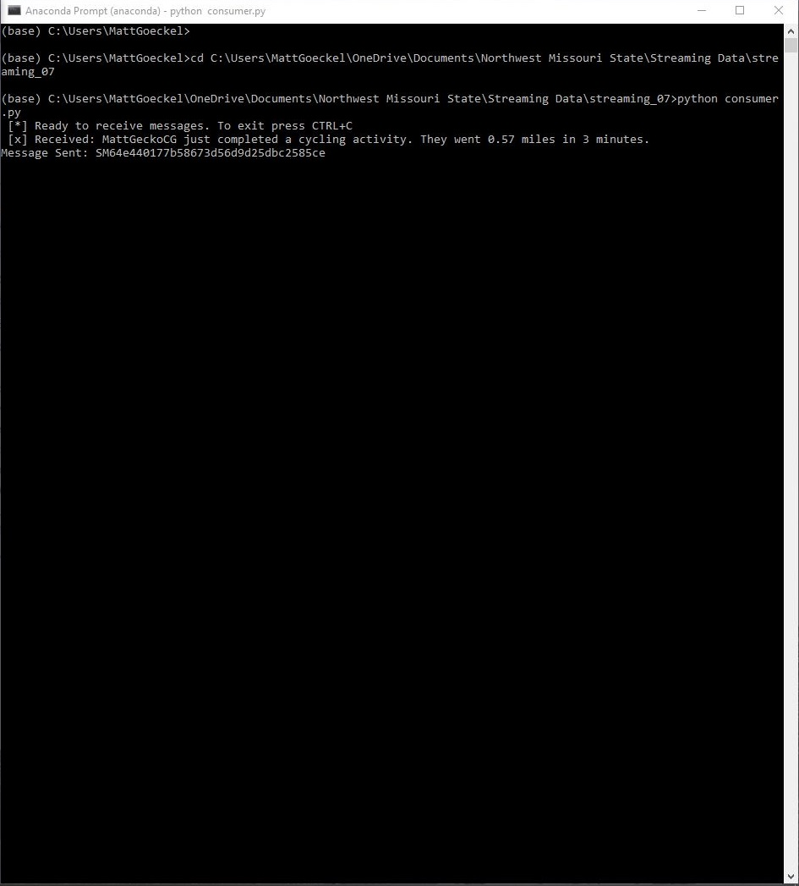
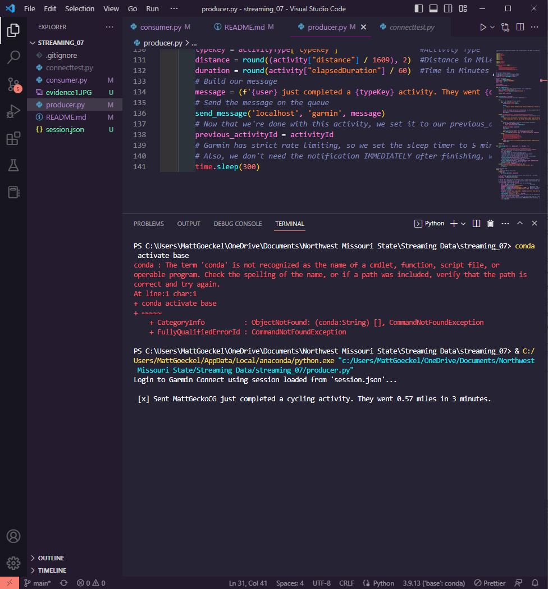
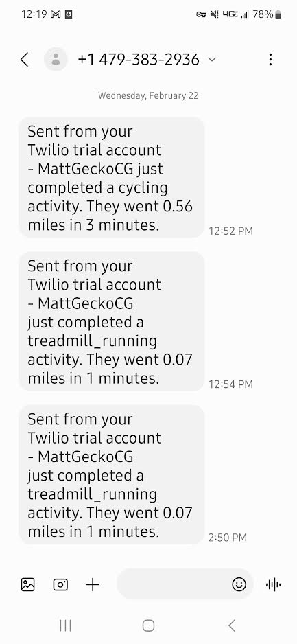

# streaming-07
Final Project for Streaming Data at Northwest Missouri State
Part 1, the producer.py file, continuously checks for uploads on Garmin Connect, and sends a message to a queue with details of the activity.
Part 2, the consumer.py file, listens on the same queue for messages, and then sends those off to the desired phone number using Twilio.

# Running the Program
Be sure to check 'Additional Packages' and 'Personalized Code Edits' below before running the program for the first time.
To begin, open up a console window that can run python. For my machine, this is the anaconda prompt. Navigate to the directory with the scripts.
`cd C:\Users\Username\your_file_path\streaming_07`
Then, run the following command:
`python consumer.py`

After this, the console should inform the user that it is ready to receive messages.
Next, start the producer in the same way using a **_second console window_**
1. Open the new console window
2. Change the directory with the same 'cd' command from above.
3. Run `python producer.py`

Now, both programs will be running. The first time, you will be prompted by the producer to login to Garmin Connect. For subsequent uses, the program will not require another login. The session will be saved, but your username and password will not. Once logged in, let the programs run and go complete an activity. When it uploads, the number you provided will receive the text.

### Additional Packages
The following packages are used in this program and are not found in the anaconda environment:
+ garminconnect
+ twilio
+ pwinput
To install these packages, use `pip install garminconnect`
Do the same for twilio and pwinput. Other packages may need to be installed if using a standard Python environment rather than anaconda.

### Personalized Code Edits
To get your code up and running, you must make a few personalized edits to the code:
1. Twilio Account Sid and Auth Token - in your consumer.py, these variables are set to 'xxxxxx' for security reasons. Replace the 'xxxxxx' with your own Account Sid and Auth token from www.twilio.com/console
2. Phone Numbers - You will also need to change the phone numbers in consumer.py. Both found in the 'send_text' method, change the sending number to your personalized number from www.twilio.com/console, and the receiving number to the phone of your choice.

# Explanation of Choices
In this project, a few third parties were used to complete the task: The garminconnect module, RabbitMQ, and Twilio

### garminconnect Python Module
The garminconnect module is not an official API from Garmin. While one does exist, their API is server-to-server only. This means it requires webhooks to be set up on an endpoint address. Obviously, I don't have a web server set up to receive their HTTP POST requests, so I had to go a different route. This module is a workaround, though it has its flaws. Rate limiting is the biggest one, since Garmin doesn't want a barrage of requests. I found that checking more than once every five minutes tended to crash the program with Garmin returning a 'url Forbidden' error. In essence, they reject the request for data.

Luckily, I don't see a problem with a message coming in a few minutes late. A common use for something like this is to let a loved one know that you completed your workout safely. A few minute delay will not be a hinderance to this.

### RabbitMQ
RabbitMQ is a message broker, which runs the queues and handles communications between producer.py and consumer.py.
We have used RabbitMQ with all of our projects over the last several weeks, so this was a way of showing my skills using the service.

### Twilio
Twilio is a communications company that loves APIs. Their most basic one can send text messages, which is exactly what I wanted.
Since Twilio has so much focus on sending text alerts, I knew they'd be able to satisfy my basic needs.

# Screenshots of Program Running

